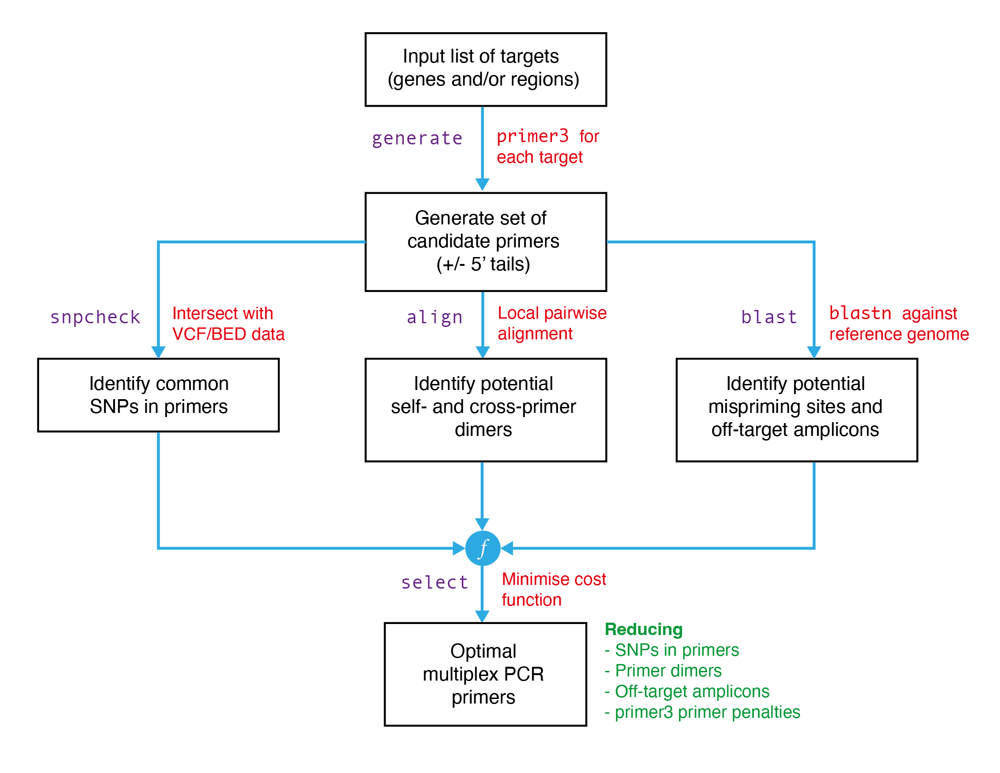

<p align="center"></p>

<p align="center">Multiplex PCR design, <i>in silico</i></p>

## Overview
`multiply` is a command-line tool enabling the design of multiplexed PCRs for a user-specified set of target genes and/or regions. It works by first producing a set of candidate primers for each target using primer3 (`multiply generate`). It then computes the number of SNPs in each primer (`multiply snpcheck`); potential dimers betweeen pairs of primers (`multiply align`); and potential mispriming and off-target amplicons for each primer (`multiply blast`). Information from these three quality control steps is passed to a cost function, which is minimised by brute-force or with a greedy search algorithm (`multiply select`). 

The pipeline is summarised below:
<br></br>
<p align="center"></p>

## Install
First, clone the repository to your local machine:

```
git clone https://github.com/JasonAHendry/multiply
```
Then, install the software dependencies using conda:

```
cd multiply
conda update conda
conda env create
conda activate multiply2
```
Finally, install `multiply` itself with pip:

```
pip install .
```

Test installation by running:

```
multiply
```

## Basic usage

#### Part 1: Download information about your target organism.
To generate a new multiplex PCR, you first need to download the reference genome (FASTA) and information about gene locations (GFF) for your target organism. To see what organisms are available for download$^1$, type:

```
multiply download --available
```

Organisms are specified by a *GenusSpecies* keyword; e.g. *PlasmodiumFalciparum* or *AnophelesGambiae*. For example, one would download information about *Plasmodium falciparum* by running:

```
multiply download -g PlasmodiumFalciparum

```

#### Part 2: Create a multiplex design file.
The next step is to specify your target genes and/or region(s) with a *design file*. Examples of design files can be seen in the `/designs` folder. Genes are specified by a comma-separated list of gene identifiers (the `target_ids` field in the design file). Regions are specified by a separate BED file, with a fourth column that gives a unique name to each region (the `bed` field). 

Candidate primers are generated using primer3. A collection of primer3 settings are available as JSON files in the folder `settings/primer3`$^2$. Multiple primer3 settings can be used in a single run of `multiply` by passing them as a comma-separated list to the `primer3_settings` field of the design file.


#### Part 3: Run.

After your target organism is downloaded and your design file is prepared, you can run the complete `multiply` pipeline with the following command:

```
multiply pipeline -d designs/<your-design-file.ini>

```

For multiplexes of moderate size (e.g. <20 targets), running the pipeline will typically take a few minutes. A directory containing results will be produced in the `results` directory, within sub-folder whose name is specified in your design file (the `name` field).

#### Footnotes

$1$ New organisms can be made available for download by adding them to the collection file located at `genomes/collection.ini`. Any organism available from ensemblgenomes (https://ensemblgenomes.org/) or plasmodb (https://plasmodb.org/plasmo/app/downloads/) can be added to the collection.

$2$ You can make your own primer3 settings by creating new or alterating existing JSON files in the `settings/primer3` folder. 

## Known limitations
TODO

## Resources
`multiply` uses the following external software and databases:
- `primer3`. Individual primer pair design. https://primer3.org/
- `bedtools`. Genome arithmetic. https://bedtools.readthedocs.io/en/latest/
- `blastn`. Local alignment search. https://blast.ncbi.nlm.nih.gov/Blast.cgi
- **plasmodb**. *Plasmodium* reference genome. http://plasmodb.org/plasmo/
